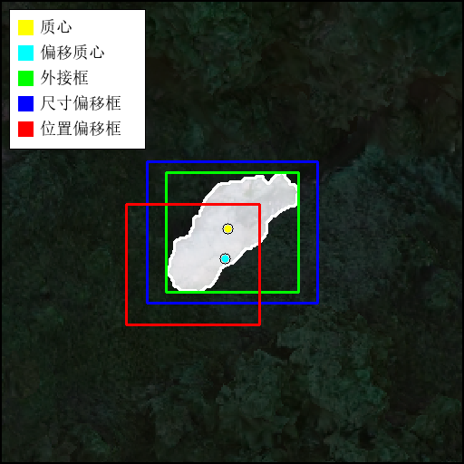
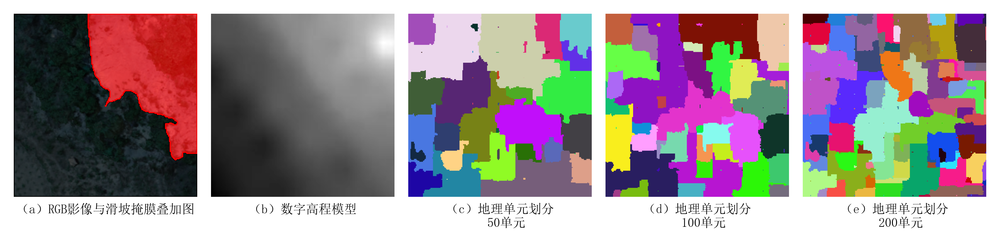
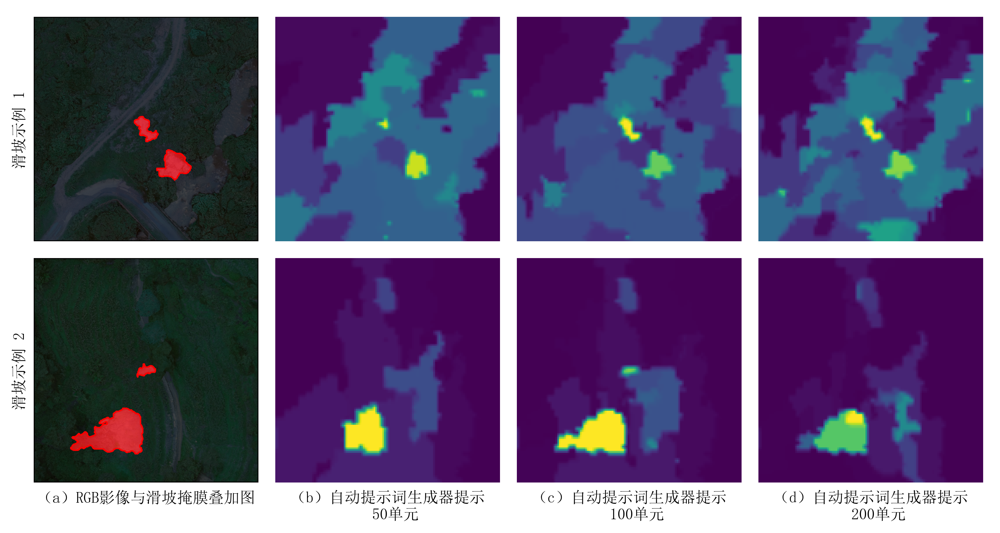
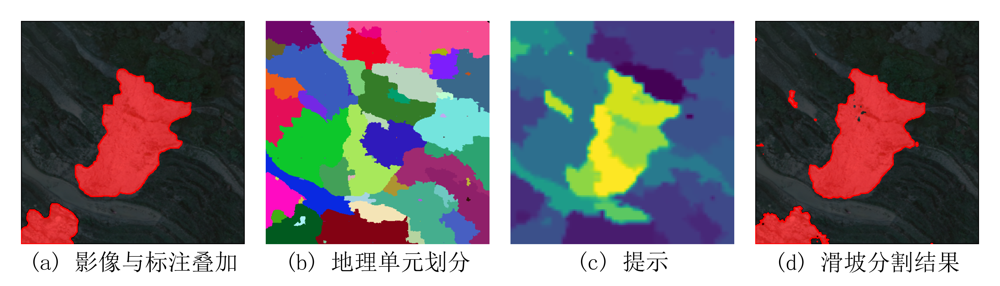

# GUK-APG-prompt-SCA-SAM

> Geographical Unit-based Knowledge-driven Automatic Prompt Generator Prompted SCA-SAM for Landslide Segmentation  
> 面向遥感影像滑坡分割的地理单元知识驱动自动提示生成方法

## 1. 项目简介

本仓库提供一种面向遥感影像滑坡精细分割任务的 **GUK-APG prompt SCA-SAM** 实现。该方法以 SCA-SAM 为基础分割框架，引入地理单元划分、知识图谱嵌入与自动提示生成机制，将滑坡孕灾环境中的地形、水文、植被、降水等多源地学知识转化为可被 SAM 利用的提示信息，从而降低对人工点提示、框提示的依赖，提升复杂山区滑坡区域的自动化识别能力。

项目核心思想如下：

1. **SCA-SAM 分割框架**  
   在 SAM 的 ViT 编码器基础上引入 Scale Context Attention（SCA）模块，并结合 LoRA 进行参数高效微调，使模型能够更好地适应遥感影像中尺度变化明显、边界破碎、背景干扰强的滑坡目标。

2. **地理单元知识建模**  
   将遥感影像对应的多源地学因子按照地理单元组织，构建空间一致的知识表达。每个地理单元可对应高程、坡度、坡向、曲率、水文指数、植被指数、降水、地貌、岩性等属性信息。

3. **GUK-APG 自动提示生成**  
   通过知识图谱嵌入与地理单元注意力，将结构化地学知识映射回影像空间，生成 mask prompt 概率图，用于驱动 SCA-SAM 完成滑坡分割。

4. **多提示策略对比**  
   代码中同时支持自动 mask prompt、质心点提示、偏移点提示、外接框提示、尺寸偏移框提示、位置偏移框提示等多种提示方式，便于分析不同提示策略对分割精度和稳定性的影响。

---

## 2. 仓库结构

```text
GUK-APG-prompt-SCA-SAM/
├── KgeModel/
│   ├── KgeBlock.py              # 知识图谱嵌入与知识特征输出模块
│   └── window_attention.py      # 地理单元/窗口注意力相关模块
├── SAM/
│   ├── build_sam.py             # SAM 模型构建入口
│   ├── sam.py                   # SAM 前向调用封装
│   └── modeling_CNN/            # SAM 编码器、解码器及相关网络结构
├── losses/
│   ├── focal.py                 # Focal 类损失函数
│   └── useful_loss.py           # 复合损失函数与分割损失
├── pretrain_weight/             # 预训练权重
├── fig/                         # 可视化结果保存目录
├── MakeModel.py                 # GUK-APG prompt SCA-SAM 总体模型定义
├── dataset.py                   # 数据集读取、知识因子读取、提示 JSON 读取
├── train_sam.py                 # 主训练脚本
├── eval.py                      # 测试与预测结果保存脚本
├── pretrain.py                  # 自动提示生成器预训练/测试脚本
├── train_utils.py               # 训练循环、验证过程、优化器与学习率策略
├── utils.py                     # 精度评价、日志重定向、权重读取等工具函数
├── bp_gen.py                    # 点/框提示生成与可视化检查
├── draw_auto_output.py          # 自动提示输出可视化
├── draw_diff_count.py           # 不同地理单元数量对比可视化
├── draw_diff_pmt_result.py      # 不同提示方式分割结果对比可视化
├── draw_diff_postprocess.py     # 不同后处理/注意力方式对比可视化
├── draw_diff_prompt.py          # 不同人工提示形式可视化
├── draw_error_cls.py            # 分割错误区域可视化
├── draw_unit_split_fig.py       # 地理单元划分结果可视化
└── draw_utils.py                # 绘图辅助函数
```

## 3. 数据集准备

当前代码采用类似 VOC 的滑坡分割数据组织形式。建议将数据集整理为如下结构：

```text
VOCdevkit_YYL/
└── VOC_landslide/
    ├── JPEGImages/
    │   ├── xxx.jpg
    │   └── ...
    ├── SegmentationObject/
    │   ├── xxx.png
    │   └── ...
    ├── Knowledge/
    │   ├── dem_img/
    │   │   ├── xxx.jpg 或 xxx.png
    │   │   └── ...
    │   ├── slope_img/
    │   ├── aspect_img/
    │   ├── twi_img/
    │   ├── spi_img/
    │   └── ...
    ├── Split50/
    │   ├── xxx.png
    │   └── ...
    ├── Split100/
    │   ├── xxx.png
    │   └── ...
    ├── Split200/
    │   ├── xxx.png
    │   └── ...
    └── ImageSets/
        └── Segmentation/
            ├── train.txt
            ├── val.txt
            └── test.txt
```

其中：

- `JPEGImages/`：输入遥感影像。
- `SegmentationObject/`：滑坡二值标注，背景为 0，滑坡区域为非 0。
- `Knowledge/`：多源地学知识因子，每个子文件夹表示一种知识因子。
- `Split50/`、`Split100/`、`Split200/`：不同数量的地理单元划分图。
- `train.txt`、`val.txt`、`test.txt`：训练、验证、测试样本名称列表，不包含后缀名。

---

## 4. 生成点提示与框提示

生成内容包括：

- `centroid`：滑坡最大连通区域质心点。
- `centroid_with_offset`：带位置偏移的质心点。
- `box`：滑坡最大连通区域外接框。
- `box_with_size_offset`：尺寸扰动框。
- `box_with_position_offset`：位置扰动框。

使用前需要修改 `bp_gen.py` 中的本地路径：

```python
mask_dir = r"G:\KGE-SwinFpn\VOCdevkit_YYL\VOC_landslide\SegmentationObject"
prompt_dir = "./prompt"
```

运行：

```bash
python bp_gen.py
```

生成后的提示文件默认保存在`./prompt`下。

---

## 5. 自动提示生成器预训练（可选）（`./pretrain_weight/epoch_64_6907.pth`为预训练结果）


`pretrain.py` 可用于预训练知识驱动自动提示生成器。其基本逻辑是：

1. 读取多源知识因子和地理单元划分结果；
2. 通过 `KnowledgeOut` 生成提示概率图；
3. 使用滑坡标注进行监督，使提示图能够响应滑坡区域；
4. 保存最优提示生成器权重。

```python
dataset_name = "YYL"
data_dict = {
    "YYL": r"G:\KGE-SwinFpn/VOCdevkit_YYL",     # 修改地址
}

```

```python
if __name__ == '__main__':
    train()      # 训练
    test()       # 测试
```

运行：

```bash
python pretrain.py
```

---

## 6. 训练 GUK-APG prompt SCA-SAM
### 6.1 自动 mask prompt 训练
运行前请先修改 `train_sam.py` 中的数据集路径：

```python
dataset_name = "YYL"
data_dict = {
    "YYL": r"G:\KGE-SwinFpn/VOCdevkit_YYL"
}
```
设置：

```python
you_want_train = "本文模型"
```
主训练脚本为：

```bash
python train_sam.py
```

训练结果默认保存到：

```text
./results/
└── YYL/
    └── MMDD_HHMMSS/
        ├── config.txt
        ├── running.txt
        └── epoch_xxx_xxxx.pth
```

其中：

- `config.txt`：当前训练配置。
- `running.txt`：训练日志。
- `epoch_xxx_xxxx.pth`：验证集 mIoU 提升时保存的模型权重。


### 6.2 人工点提示/框提示训练

若要对比不同人工提示方式，可使用设置：

```python
you_want_train = "标准质心"
```
```python
you_want_train = "偏移质心"
```
```python
you_want_train = "标准框"
```
```python
you_want_train = "尺度偏移框"
```
```python
you_want_train = "位置偏移框"
```

对应含义参考 `./fig/Diff_pmt.png`：



---

## 7. 模型测试与预测结果保存

测试脚本为：

```bash
python eval.py
```

运行前需要修改以下内容：

```python
dataset_name = "YYL"
sp_count = "200"      # 选择地理单元数量，可设为 `"50"`、`"100"` 或 `"200"`。
post_mode = "unit"    # unit为本文所提地理单元注意力，window为标准vit窗格注意力，None为无特征后处理
data_dict = {
    "YYL": r"G:\KGE-SwinFpn/VOCdevkit_YYL"
}
```
示例：

```python
if __name__ == "__main__":
     eval_element(f"./results/YYL/auto")
```

预测掩膜默认保存到：

```text
vis_results/
└── auto200/
    ├── xxx.png
    └── ...
```

测试时会输出：

```text
pa: ...
mpa: ...
miou: ...
```

---

## 8. 可视化脚本说明
仓库中提供多种实验图绘制脚本，用于论文结果展示和消融分析。
### （a） `draw_utils.py`
可视化通用函数。

### （b） `draw_unit_split_fig.py`
绘制 RGB 影像、DEM 和不同地理单元数量划分结果。

### （c） `draw_auto_output.py`
绘制自动提示生成器在不同地理单元数量下的输出响应。

### （d） `draw_diff_count.py`
对比不同地理单元数量对分割结果的影响。

### （e） `draw_diff_prompt.py`
绘制质心点、偏移点、外接框、扰动框等提示形式。

### （f） `draw_diff_pmt_result.py`
对比不同提示方式下的滑坡分割结果。

### （g） `draw_error_cls.py`
绘制误分、漏分等错误区域。

### （h） `draw_diff_postprocess.py`
对比 unit/window/None 等后处理或注意力设置。


注意：多数绘图脚本中包含本地绝对路径，例如：

```python
data_dir = r"G:\KGE-SwinFpn/VOCdevkit_YYL"
```

运行前需要改为自己的数据集路径。

